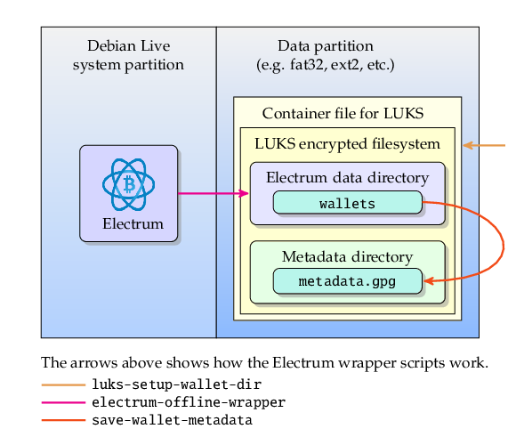

# Electrum wallet software on bootable USB memory

Bitport is [Electrum](https://electrum.org/) Bitcoin wallet software on a bootable Debian live system.
The Electrum wrapper code makes it easy to keep the wallet data secure within a LUKS encrypted filesystem.
It can be installed on a USB flash drive so that you can run Electrum on any PC that can boot from a USB device.
Bitport is meant to be used as Bitcoin offline [cold storage](https://en.bitcoin.it/wiki/Cold_storage) that stores Bitcoin private keys in a secure air-gapped system.


# Features

Bitport has the following features.

* Bitport is a bootable live Linux based on Debian Linux.
* It is a cost effective implementation for Bitcoin cold storage.
* Electrum on Bitport accommodates multiple wallets.
* The live system is installed in a drive partition so that we can use the unused space of the device for other partitions to store any data including Electrum wallets.
* It uses [LUKS](https://gitlab.com/cryptsetup/cryptsetup/blob/master/README.md) encrypted filesystem to store wallet data, so the wallet data is doubly protected by encryption if the user chooses to enable the wallet encryption option of Electrum.
* It is very easy to securely back up the wallet data to other similar devices.
* When the Debian live system is running all of its filesystem contents are on a RAM drive so no files will persist after shutdown except for data stored on the wallet data partition.
* It is built from vanilla Debian packages, the official Electrum source code package and the wrapper shell scripts so it is easy to inspect the code security.
* It is trivial to upgrade Electrum to a newer version in the build process because we use the packaged version of Electrum (run_electrum) instead of creating Debian packages for Electrum and its dependency libraries.
* It uses standard XFCE desktop environment and it is easy to change it to other desktop at build time.
* It provides a facility to store wallet metadata (including the Electrum seed phrase) in [GPG](https://gnupg.org/) encrypted files within the same LUKS filesystem.

At the same time we have the following restrictions :

* Bitport limits the usage of Electrum to offline mode only. (The reasoning is that using the same device for offline and online modes could be a security weakness.)
* Bitport supports Electrum but not other wallet software. (It should be easy to add support for Electrum-LTC.)
* Bitport doesn't use an ISO-9660 image but directly installs a bootable Debian live system on a drive.
* Users need to create the Debian live system using the provided build scripts and the official Debian package repository.


# How it works

Generally the partition 1 of the drive hosts the Debian live system, while the partition 2 hosts the container file for the LUKS encrypted filesystem.
The Electrum code is placed under `/opt/electrum/` directory of the live system so it will not interfere with Debian package files.



The user can manually mount the second partition of the drive so that the LUKS setup script can configure the container file for the LUKS encrypted filesystem.
The mount point of the second partition filesystem is `/media/user/EDATA/` and the container file will be `/media/user/EDATA/electrum/electrum_data.fs`.
This manual mounting/un-mounting gives us flexibility of switching between different partitions/devices that have the same filesystem label EDATA.

The LUKS setup script will ask the user for the passphrase to use for the LUKS encryption.

When the Electrum wrapper script is launched it will prompt the user for the LUKS passphrase (which has already been configured via the setup script) and mount the LUKS encrypted filesystem at the mount point `/data_dir/`.
After mounting the LUKS volume the Electrum wrapper will run Electrum by the command line :
```
run_electrum --offline --dir=/data_dir/electrum/.electrum
```
This means all wallets will be stored in the directory `/data_dir/electrum/.electrum/wallets/`.

When the user chooses to store wallet metadata (together with seed phrase) the script will encrypt it via GPG command and then placed the result under
`/data_dir/electrum/metadata/`.
If the wallet file name is `/data_dir/electrum/.electrum/wallets/XYZ` then the suggestion for its associated metadata file will be
`/data_dir/electrum/metadata/XYZ_metadata.gpg`.


# Requirements

To create Bitport devices you need the followings :

* Debian Linux host PC to build the live system image.
* Network connection to the Debian repository.
* Bitport source code cloned from the repository.
* The Electrum source code package downloaded from the official site.
* USB flash memory card with capacity larger than 1 GB.
* PC (BIOS or UEFI) to boot the Bitport system from USB.

The user needs to keep the three types of passphrases to ensure access to the Electrum wallets :

* LUKS volume passphrase.
* Password(s) for Electrum wallet(s).
* GPG passphrase(s) for wallet metadata file(s) that correspond to wallet(s).


# Build Debian live system and install it on a USB device

See [Installation](doc/Install.md).


# Usage

See [Usage](doc/Usage.md).


------------------------------------------------------------------------------
