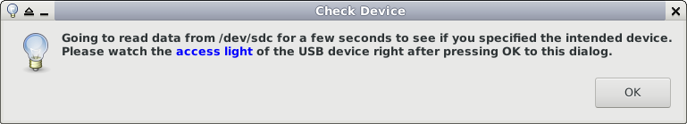
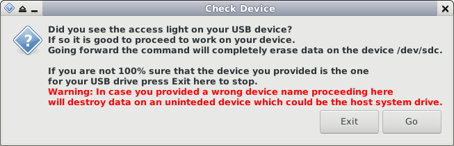
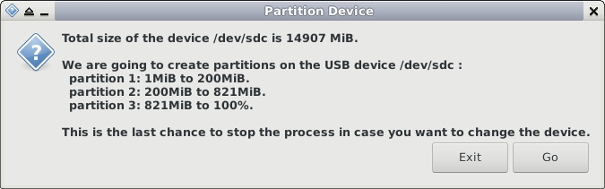

# Build Debian Live system for Electrum

We will build our Debian live system following an excellent guide for creating a bootable system at [Create a Custom Debian Live Environment (CD or USB)](https://willhaley.com/blog/custom-debian-live-environment/).

The guide describes two methods for creating a bootable device: 1) writing an ISO-9660 image to the whole drive, 2) installing the kernel, initrd and a Squash filesystem image directly on a device partition.
We will use the method 2 for our purpose because it allows to have the Debian live system installed in a device partition as opposed to the whole device so that we can use the remaining space of the device for other use such as for the wallet data storage.
There may be a way to write an ISO-9660 image in a drive partition instead of the whole drive, but I haven't explored that yet.

We can create a bootable drive for the BIOS based computers using Grub bootloader and the same can be done for UEFI based systems.
However it seems not easy to create a drive bootable for both BIOS and UEFI systems.
We use syslinux and grub to create a system bootable on BIOS systems as well as UEFI systems.
I tried the pure grub bootloader approach that uses hybrid MBR as described in the guide but I didn't have a success with grub-install command.

Creating a bootable USB flash memory drive involves writing files directly to the drive device, and writing to a device means complete loss of the existing data on the device.
You need to be really careful in choosing the right device name for this.

Also the build steps below need to be done in the given sequence.
Please follow the instructions below in their order so that you can avoid unexpected results.

We have the following steps:

01. Enabling sudo on the host
01. Set work directories and target architecture
01. Bootstrap a Debian system
01. Customize the Debian system in the chroot environment
    * Configure network and kernel in the chroot environment
    * Install desktop packages in the chroot environment
    * Install Electrum dependency packages in the chroot environment
    * Configure settings in the chroot environment
01. Install Electrum
01. Customize Debian configuration
01. Prepare live system image
01. Installation of live system on the device


## Enabling sudo on the host

First install the sudo package on the host system and configure your account so that you can run sudo command under your account.
For example see [this suggestion](http://milq.github.io/enable-sudo-user-account-debian/).
The build scripts under directory `setup` requires sudo.


## Set work directories and target architecture

We are going to work with two separate directories:

* **CODE\_DIR** :
  This is the directory where Bitport repository was cloned. `CODE_DIR` should have `README.md` file and other directories.
* **LIVE\_BOOT\_BASE** :
  This is the directory in which the live system is going to be built.
  You should not have any file contents in this directory before starting to work on it.

Within a bash shell set these shell environment variables:
```
  $ export CODE_DIR=<base-directory-bitport-was-cloned>
  $ export LIVE_BOOT_BASE=<live-boot-base-directory-of-your-choice>
  $ /bin/mkdir -p "${LIVE_BOOT_BASE}"
```

We need to set environment variables for the target live system architecture and Debian version codename.
The target live system architecture can be either `amd64` or `i386`, where `amd64` is for 64-bit AMD architecture and `i386` is for 32-bit Intel architecture.
The Debian version codename such `buster` as can be chosen from the list available at [Debian Releases](https://www.debian.org/releases/).
```
  $ export TARGET_SYSTEM_ARCHITECTURE=amd64
  $ export TARGET_SYSTEM_DEBIAN_VERSION_CODENAME=buster
```

It looks like Debian (and many Linux distributions) don't support UEFI boot i386 architecture, so we assume if the target host boots only from UEFI it is amd64 architecture.

We are going to work within this shell throughout the build process.
If you exit the shell these environment variables will be cleared.
So if you exit the shell before completing the whole process it is necessary to set them again.

## Bootstrap a Debian system

Run the script :
```
  $ "${CODE_DIR}"/setup/install-build-packages.sh
```

This does two things:

* Install Debian packages used for building a live Debian system.
* Bootstrap a Debian system in the directory `${LIVE_BOOT_BASE}/chroot`.

If the directory `${LIVE_BOOT_BASE}/chroot` already exists the script will not do anything so that it avoids messing the existing directory content.

## Customize the Debian system in the chroot environment

This step needs to be done manually within the chroot environment.

As with the Custom Debian live guide above the notation **`[chroot]#`** in the command line below means the command there is to be run within the chroot environment.
Again as the guide author warns us the commands meant for the chroot environment should not be run in the regular local environment.

Get into the live system root directory by running chroot command :
```
  $ /usr/bin/sudo /usr/sbin/chroot "${LIVE_BOOT_BASE}/chroot"
  [chroot]# 
```

### Configure network and kernel in the chroot environment

We are going to configure Debian in the chroot environment.

First we set the hostname and obtain package updates from the Debian package repository over the network.
```
  [chroot]# /bin/echo debian-live > /etc/hostname
  [chroot]# 
  [chroot]# /bin/cat /etc/hosts | /bin/sed -E -e '/127.0.0.1\s+localhost/a 127.0.0.1 debian-live' > /etc/hosts.temp
  [chroot]# /bin/mv /etc/hosts /etc/hosts.old
  [chroot]# /bin/mv /etc/hosts.temp /etc/hosts
  [chroot]# 
  [chroot]# /usr/bin/apt-get update
  ...
  [chroot]# 
```
What the sed script above does is to  add a line `127.0.0.1 debian-live` in `/etc/hosts` so you can do it manually instead.

Find the exact package name of linux-image that matches the Debian version for the target live system (might not be the same as the build host system) :
```
  [chroot]# /usr/bin/apt-cache search linux-image | grep linux-image
  ...
  linux-image-amd64 - Linux for 64-bit PCs (meta-package)
  ...
  [chroot]# 
```

If the target PC is 64-bit amd64 architecture choose `linux-image-amd64`.
For 32-bit i386 architecture PC choose `linux-image-686`.
This should corresponds to the architecture set as `${TARGET_SYSTEM_ARCHITECTURE}` in the beginning.

Install the found linux-image and live-boot, systemd-sysv in the chroot environment :
```
  [chroot]# /usr/bin/apt-get install --no-install-recommends linux-image-amd64 live-boot systemd-sysv
  ...
  [chroot]# 
```

### Install desktop packages in the chroot environment

Continuing in the chroot environment,
install these desktop packages and their dependency packages :
```
  [chroot]# /usr/bin/apt-get install \
    xfdesktop4 xfce4 xfce4-session xfwm4 xfce4-terminal xfce4-panel \
    xfce4-power-manager xfce4-battery-plugin xfce4-clipman \
    xfce4-clipman-plugin xfce4-notes xfce4-cpugraph-plugin \
    xfce4-screenshooter xfce4-sensors-plugin xfce4-taskmanager \
    xinit vim thunar lightdm leafpad \
    ristretto feh mupdf \
    sudo diceware man-db manpages
  ...
  [chroot]# 
```

The package script of keyboard-configuration will ask to choose the keyboard layout for the target machine.
Select the best one, and follow the instruction of Debian install scripts.

These packages are a sort of minimal set that supports XFCE desktop, and you can add more packages if needed.

### Install Electrum dependency packages in the chroot environment

The package libsecp256k1-0 is optional for Electrum but speeds up its ECDSA computation (Electrum-3.3.2/electrum/ecc_fast.py).
The package libzbar0 is used to capture QR code through the webcam (Electrum-3.3.2/electrum/qrscanner.py).
Install these packages including Electrum dependency pyqt5 :
```
  [chroot]# /usr/bin/apt-get install python3-pyqt5 libsecp256k1-0 libzbar0
  ...
  [chroot]# 
```

Install Electrum wrapper dependency packages :
```
  [chroot]# /usr/bin/apt-get install cryptsetup-bin libcryptsetup12 yad gpg pinentry-gnome3 bash
  ...
  [chroot]# 
```

Delete apt cache files to save space :
```
  [chroot]# /usr/bin/apt-get clean
  ...
  [chroot]# 
```

### Configure settings in the chroot environment

Continuing in the chroot environment,
set the root password :
```
  [chroot]# /usr/bin/passwd root
  ...
  [chroot]# 
```

Add a user account 'user' and its password :
```
  [chroot]# /usr/sbin/adduser user
  [chroot]# 
```

It is important to remember root and user passwords.
It would be ok to set simple and easy to remember passwords because our only use case is for the cold storage and Electrum wallets are protected by double encryption.

Add 'user' into necessary groups :
```
  [chroot]# /usr/sbin/adduser user plugdev
  [chroot]# /usr/sbin/adduser user audio
  [chroot]# /usr/sbin/adduser user video
  [chroot]# /usr/sbin/adduser user sudo
  [chroot]# 
```

Add autologin group and add user in it :
```
  [chroot]# /usr/sbin/groupadd -r autologin
  [chroot]# /usr/sbin/adduser user autologin
```

Later modification with lightdm (section Customize Debian configuration) will enable automatic login for user without need for typing its password.
Also later modification to /etc/sudoers will let the account user run sudo for a certain set of commands (that are used by Electrum wrapper) without the password.

Now all work in the chroot environment is done so exit it:
```
  [chroot]# exit
  $ 
```

## Install Electrum

Download the official Electrum source code tar.gz file (e.g. Electrum-3.3.2.tar.gz) and its signature file (e.g. Electrum-3.3.2.tar.gz.asc) from [https://electrum.org/#download](https://electrum.org/#download).
The download page says the signature is by ThomasV with the link to [https://pgp.mit.edu/pks/lookup?op=vindex&search=0x2BD5824B7F9470E6](https://pgp.mit.edu/pks/lookup?op=vindex&search=0x2BD5824B7F9470E6).
Import the key in your host system:
```
  $ /usr/bin/gpg --keyserver pool.sks-keyservers.net --recv-keys 2BD5824B7F9470E6
```
and verify the signature. Here is an example of Electrum-3.3.2 :
```
  $ /usr/bin/gpg --verify Electrum-3.3.2.tar.gz.asc Electrum-3.3.2.tar.gz
  gpg: Signature made Fri Dec 21 14:08:41 2018 PST
  gpg:                using RSA key 2BD5824B7F9470E6
  gpg: Good signature from "Thomas Voegtlin (https://electrum.org) <thomasv@electrum.org>" [unknown]
  gpg:                 aka "ThomasV <thomasv1@gmx.de>" [unknown]
  gpg:                 aka "Thomas Voegtlin <thomasv1@gmx.de>" [unknown]
  gpg: WARNING: This key is not certified with a trusted signature!
  gpg:          There is no indication that the signature belongs to the owner.
  Primary key fingerprint: 6694 D8DE 7BE8 EE56 31BE  D950 2BD5 824B 7F94 70E6
  $ 
```

Set the shell environment variable `ELECTRUM_TGZ` to the path of the downloaded source code:
```
  $ export ELECTRUM_TGZ=<absolute-path-to-the-downloaded-electrum-source-tar.gz-file>
```

Now we can install Electrum in the `${LIVE_BOOT_BASE}/chroot/opt/electrum/` with the following command:
```
  $ "${CODE_DIR}"/setup/install-electrum.sh
```

This script installs Electrum, its wrapper code and launchers as follows :

* expand `Electrum-?.?.?.tar.gz` into `${LIVE_BOOT_BASE}/electrum/`
* copy `${LIVE_BOOT_BASE}/electrum/Electrum-?.?.?/` to `${chroot_dir}/opt/electrum/`
* copy `${code_dir}/wrapper/` to `${chroot_dir}/opt/electrum/`
* copy `${code_dir}/launcher/*` to `${chroot_dir}/usr/local/share/applications/` replacing ${ELECTRUM_VERSION} with the actual Electrum version.

## Customize Debian configuration

Run the script:
```
  "${CODE_DIR}"/setup/customize-debian-config.sh
```

This copies the following custom configuration files:

* `/etc/lightdm/lightdm.conf` for automatic login.
* `/etc/sudoers` for sudo without password for these commands: modprobe, cryptsetup, e2fsck, mkfs.ext2, mount, umount, mkdir, chown, shutdown.
* `/etc/xdg/xfce4/xfconf/xfce-perchannel-xml/xsettings.xml` for setting font Xft DPI and disabling cursor blinking.
* `/etc/xdg/xfce4/xfconf/xfce-perchannel-xml/thunar.xml` for setting default view of the file browser.

## Prepare live system image

Run the script:
```
  "${CODE_DIR}"/setup/prepare-live-image.sh
```

This copies necessary files from the chroot directory to the image root directory in the following directory structure :
```
    LIVE_BOOT_BASE/
      chroot/
      image_root/
        DEBIAN_CUSTOM
        boot/
          grub/
            grub.cfg
          syslinux/
            syslinux.cfg
            menu.c32
            libutil.c32
            ...
        live/
          vmlinuz-X.X.X-X-XXX
          initrd-X.X.X-X-XXX
          filesystem.squashfs
```

You can run this script multiple times to reflect the changes made in the chroot environment.

## Installation of live system on the device

In this step we are going to partition the device and copy the files placed under `image_root/` to the system partition of the device.

First to find which devices are currently recognized on the host system run the command `/bin/lsblk`.

Now take the USB flash memory device that you are going to use for the bootable Debian live system, plug it into the host system and again run `/bin/lsblk` to find the device name of the one that was just plugged in.
Assuming the device name of the USB flash memory was found to be `/dev/sdx`, we are going to use this device name `/dev/sdx` in the scripts below for writing the live system to the device.

Because it is crucial to provide the right device name for this step, the script will ask you twice to make sure you supplied the intended device name.

-   It will first present a dialog window to let you know that it will read some of the device data so that you can see the access light to make sure the device is the right one.

    

-   After reading some amount of data from the device it will request the first confirmation.

    

-   Then it will calculate required partition size for the live system and present a dialog window for acknowledgment of writing to the device.
    You can stop here if you find you got a wrong device.

    

When partitioning, formatting, labeling of the filesystems are all done the script will proceed to the installation of the live system and print the status messages.


Run this script to create a Debian live system bootable both on a BIOS boot system (via syslinux) and a UEFI boot system (via grub) :
```
  "${CODE_DIR}"/setup/install-live-syslinux-bios-grub-uefi.sh /dev/sdx
```

An alternative script for creating a BIOS bootable Debian live system. This uses only grub bootloader.
```
  "${CODE_DIR}"/setup/install-live-grub-bios.sh /dev/sdx
```

An alternative script to create a UEFI bootable Debian live system. This uses only grub bootloader.
```
  "${CODE_DIR}"/setup/install-live-grub-uefi.sh /dev/sdx
```

Now installation is complete and the USB drive is ready for use.


## Note

### Partitioning

Our script creates the data partition with the filesystem label EDATA that fills all the way to end of available drive space.
However you can change make this partition smaller and use the rest of the space for other partitions as long as there is enough space for the LUKS container file in the filesystem EDATA.


### Possible boot problems

Our grub.cfg and syslinux.cfg don't have the kernel parameter `quiet` to make it easier to diagnose the situation by looking at the kernel messages through the booting process.

#### "Invalid magic number" error

After selecting a boot entry from the grub bootloader menu, booting process could stop with the error message:
```
    error: invalid magic number.
    error: you need to load the kernel first.
```
I am sure this could be caused by many conditions but what I found is the bootloader gets confused by the ISO-9660 partition signature left on the drive when an ISO-9660 image was written to it before.
The `parted` command does not clear this signature so when you create Bitport on this device and try to boot from the device it fails with the error message above.
A solution is to clear this signature by running the command to clear the signature
```
    sudo wipefs --all --types iso9660 "${device}"
```
or completely clear all partition signatures:
```
    sudo wipefs --all "${device}"
```
before creating partitions with `parted`.

The first option of the command is already included in the setup script `prepare-live-image.sh`.
In case it doesn't work you can try the second.

#### Booting stops after message "started update utmp about system runlevel changes"

Booting process could stop after printing the status message `started update utmp about system runlevel changes`.
There could be many reasons for this but it looks like graphics failures cause this error.
Old computers seem to fail in booting without the kernel parameter `nomodeset` but newer computers seem to fail with `nomodeset`.
Our grub.cfg and syslinux.cfg have one boot option with `nomodeset` and another without `nomodeset`.
Please try the other option in the bootloader menu (syslinux or grub) if you encounter this problem.


## References

-   [<https://electrum.org>]
    Official Electrum site with the download and instruction links.

-   [<https://bitcoinelectrum.com>]
    Electrum extra documents

-   [<https://github.com/bitkey/bitkey>]
    Bitkey is cryptocurrency wallet software installed on a bootable live system based on Turnkey Linux.
    We used many of its useful ideas in designing Bitport.

-   [<https://wiki.archlinux.org/index.php/Dm-crypt/Encrypting_a_non-root_file_system>]
    Detailed description of LUKS filesystem and how to use cryptsetup for loop devices.

-   [<https://unix.stackexchange.com/questions/302400/auto-login-on-xfce-in-jessie>]
    How to let a user login without need for typing password.

-   [<https://willhaley.com/blog/custom-debian-live-environment/>]
    Excellent article on how to create a bootable custom Debian live system. The author gives the list of many useful references based on his extensive research on the topic.

-   [<https://unix.stackexchange.com/questions/382817/uefi-bios-bootable-live-debian-stretch-amd64-with-persistence>]
    Another great article on how to create bootable drive from an official Debian live ISO image using syslinux and grub.

-   [<https://manpages.debian.org/jessie/live-boot-doc/live-boot.7.en.html>]
    The meaning of kernel parameter boot=live etc.

-   [<https://wiki.archlinux.org/index.php/syslinux>]
    Definitive guide for Syslinux.

-   [<https://www.gnu.org/software/grub/manual/grub/grub.html>]

-   [<https://bbs.archlinux.org/viewtopic.php?id=232662>]
    Discussion on how to fix boot error "invalid magic number".

-   [<https://superuser.com/questions/14860/how-to-remove-iso-9660-from-usb>]
    How to remove iso-9660 partition signature that was created when an ISO-9660 image was written to the whole device.

-   [<https://askubuntu.com/questions/716957/what-do-the-nomodeset-quiet-and-splash-kernel-parameters-mean>]
    Good description of pros and cons of the kernel parameter nomodeset.

-   [<https://www.reddit.com/r/linuxquestions/comments/5jn4qe/stuck_at_started_update_utmp_about_system/>]
    Debian doesn't support UEFI secure boot so you need to disable it for Debian live drive to boot on such machines.

------------------------------------------------------------------------------
