# Using Bitport

Once the Bitport USB device was created you should not plug it into an online computer
because Linux system or Electrum installed on the USB partition could be rewritten,
and also the LUKS filesystem could be exposed to the network for some reasons.


## Booting Bitport

On an older BIOS based computer that doesn't have UEFI Secure Boot you only need to enable booting from an external USB drive in the BIOS settings.

If the computer has UEFI Secure Boot the original installed OS must be Windows.
Then you need to disable hibernation and Fast Startup in Windows.
Also you need to enable booting from an external USB drive in the BIOS settings.
Disabling Quick Boot in the BIOS settings might be needed in some occasions.

Then you can boot from the USB drive either via BIOS drive selection dialog usually by pressing a function key (which depends on the manufacture) during BIOS startup.
On Windows 10 you can boot from a USB drive by going to Settings > Update & Security > Recovery > Advanced Startup > Use a device > USB HDD to boot from the external USB.
Then grub will boot and show some options for booting Debian live.
Timeout before booting the default option was set to 30 seconds in the build step.

The system will automatically login to the account 'user' directly landing on the XFCE desktop.
However screen lock is enable so you will have to type the password after 10 minutes of idle time.
Passwords were set while building the system.


## Bitport scripts

There are six wrapper scripts:

01. luks-setup-wallet-dir

    Use this to set up LUKS encrypted filesystem on the data partition of the drive.
    Run this script before using Electrum.
    It creates a LUKS encrypted filesystem within the container file `/electrum/electrum_data.fs` in the data partition filesystem which is a FAT32 filesystem.
    You need to decide the LUKS passphrase here.
    Please keep your passphrase in multiple safe places.
    When the script finishes the LUKS volume will be closed.

01. electrum-offline-wrapper

    This is the Electrum wrapper and runs Electrum in the offline mode.
    You need to enter the LUKS passphrase set in the previous step so that Electrum can access the LUKS volume.
    After the LUKS volume gets mounted at `/data_dir` the script will run Electrum as the following

    ```
    run_electrum --offline --dir=/data_dir/electrum/.electrum
    ```

    All of Electrum data will be stored in `/data_dir/electrum/.electrum/`.
    When the script finishes the LUKS volume will be closed.

01. save-wallet-metadata

    Save wallet metadata in the metadata directory.
    Usually this script will not be needed because when new wallets are created by Electrum while running electrum-offline-wrapper the wrapper script will ask the user to save their metatada right after closing Electrum.
    However you can do the same thing with save-wallet-metadata.

01. display-wallet-metadata

    Display wallet metadata saved in the metadata directory.
    You need to enter the LUKS passphrase so that it can access the encrypted content.
    When the script finishes the LUKS volume will be closed.

01. luks-add-passphrase

    Add a new LUKS passphrase along with the existing ones.
    You need to enter one of existing LUKS passphrases.

01. luks-change-passphrase

    Change one of the existing LUKS passphrases with a new one.
    You need to enter one of existing LUKS passphrases.
    Removing a passphrase needs to be done manually via `cryptsetup` command because scripting it is dangerous in that it can remove the last available passphrase effectively disabling access to the encrypted content forever.

### luks-setup-wallet-dir

Before starting to use Electrum you first need to set up the LUKS encrypted filesystem on the data partition of the drive.

01. Mount the filesystem with the label EDATA by right-clicking on the device icon that appears on the desktop.

    After booting the system you will see two filesystem icons along with the standard filesystem icon on XFCE desktop.
    The label `EDATA` shows the FAT32 filesystem on the data partition of the Bitport USB drive.

    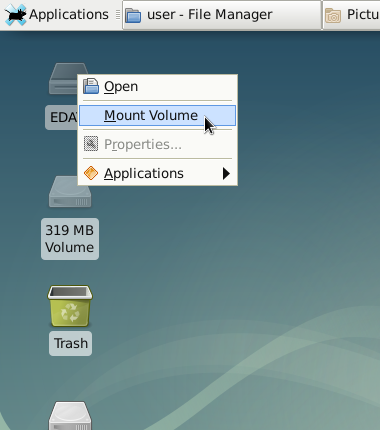

01. Run luks-setup-wallet-dir from the XFCE menu launcher.

    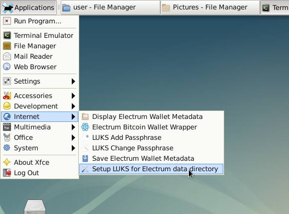

01. Set the size for the LUKS container file.

    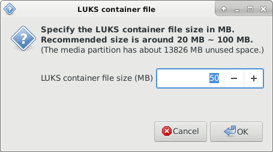

01. Message about the new LUKS volume passphrase. You can either hide the passphrase while you are typing it or show it.

    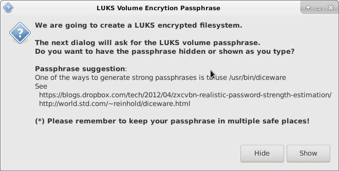

01. Set the new LUKS volume passphrase.

    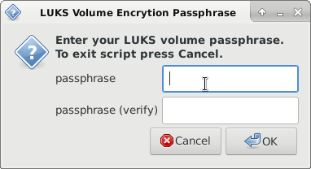

01. Set up of the new LUKS volume is completed.

    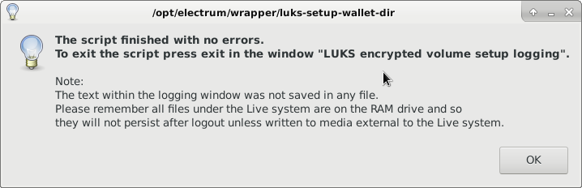

01. Note that the logging messages are not saved in a file.
    However you can save it in an external media by copy and pasting.

    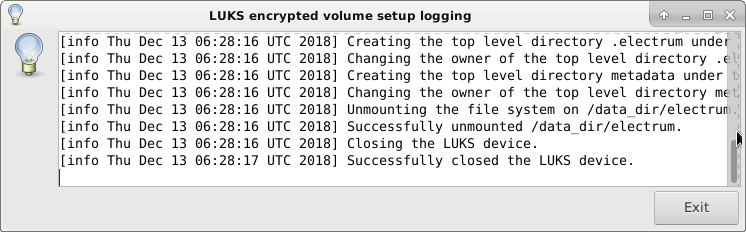

01. You can see the container file in the file browser.

    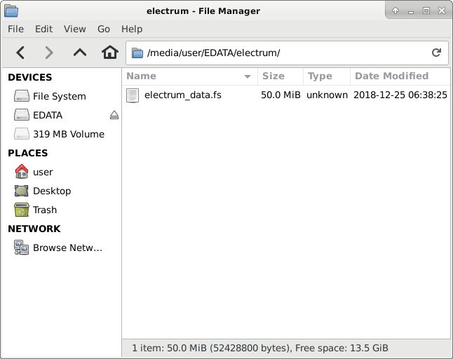

### electrum-offline-wrapper

Once the LUKS encrypted filesystem was configured on the data partition you can run Electrum.

01. Run electrum-offline-wrapper from the XFCE menu launcher.

    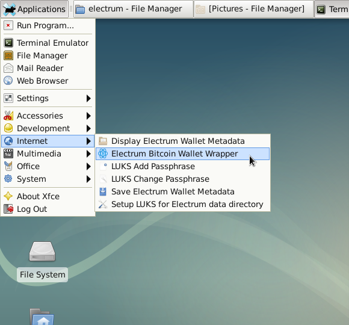

01. You need to choose whether to show the LUKS passphrase when opening the LUKS volume.

    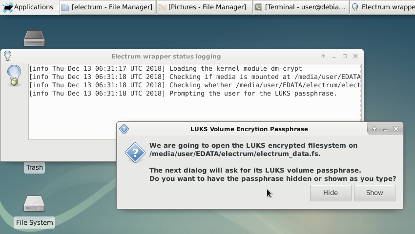

01. Enter the passphrase you set via luks-setup-wallet-dir.

    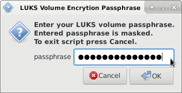

01. Electrum starts with the initial dialog.

    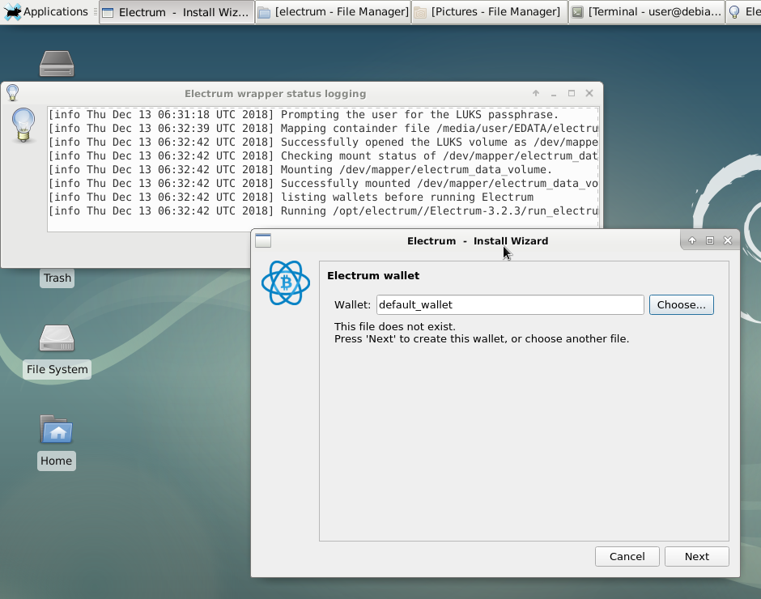

01. Setting a new Electrum wallet.

    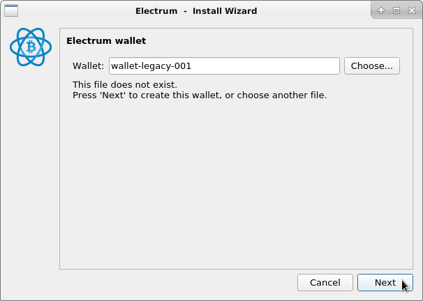

01. Got a new Electrum wallet.

    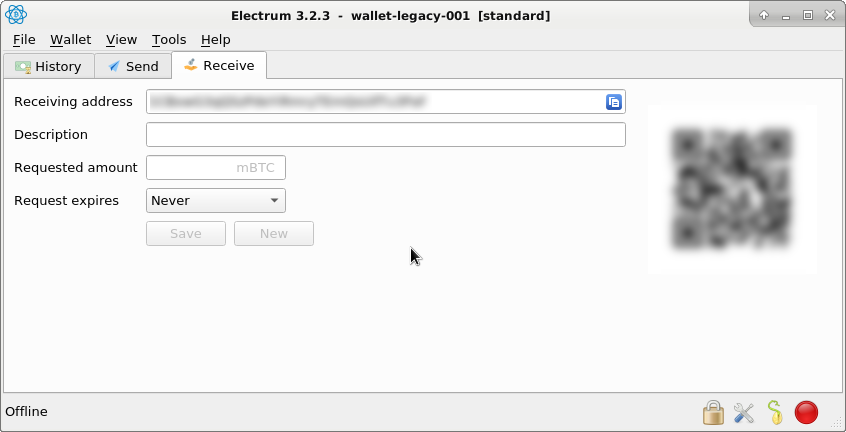

01. Exiting Electrum.

    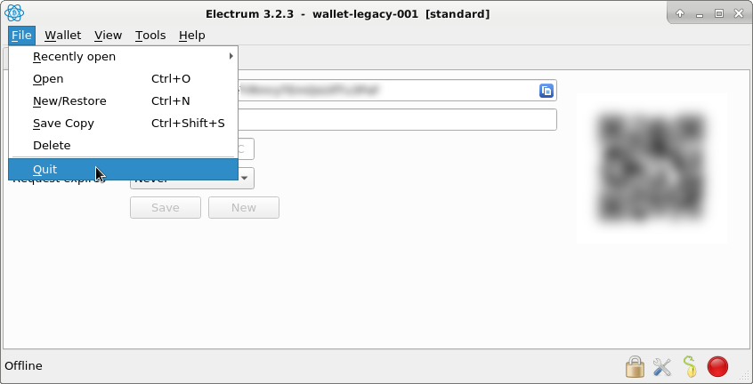

01. Wrapper code found a new wallet was added.

    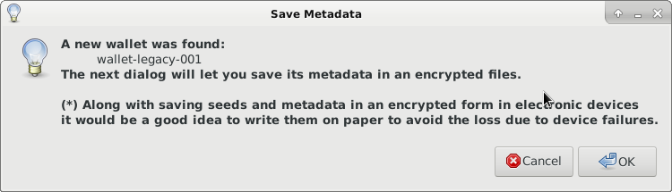

01. Fill metadata for the wallet just selected.

    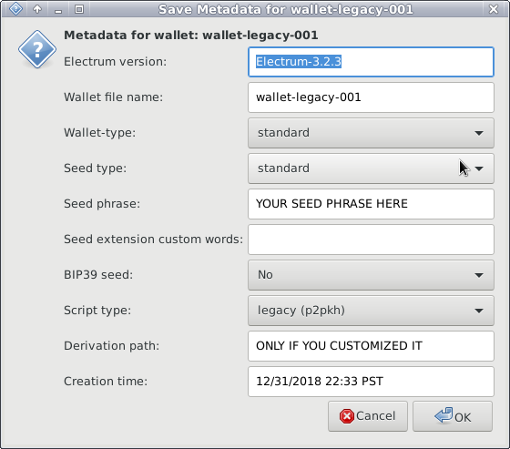

    The metadata items are as follows :

    01. Electrum version (Filled automatically based on the installed Electrum.)
    01. Wallet file name
    01. Wallet type := standard | two-factor authentication | multi-signature | import
    01. Seed type := standard | segwit
    01. Seed phrase
    01. Seed extension custom words
    01. BIP39 seed := No | Yes
    01. Script type := legacy (p2pkh) | p2sh-segwit (p2wpkh-p2sh) | native segwit (p2wpkh)
    01. Derivation path
    01. Creation time

01. Modify metadata file if needed.

    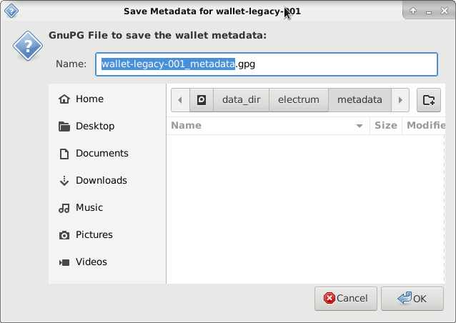

01. Message about passphrase dialog for GPG symmetric cipher encryption.

    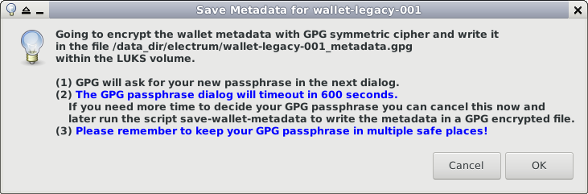

01. GPG passphrase dialog.

    Our GPG passphrase dialog has the timeout of 600 seconds. If you need more time you can cancel this dialog and come back to this by running `save-wallet-metadata`.

    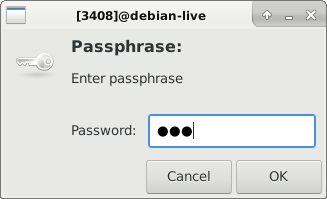

01. Electrum wrapper completed.

    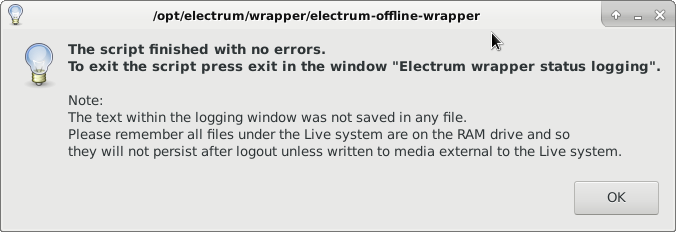


### save-wallet-metadata

The whole process will be the as these steps for *electrum-offline-wrapper*
from *Wrapper code found a new wallet was added* to *GPG passphrase dialog*.

01. Run electrum-offline-wrapper from the XFCE menu launcher.

    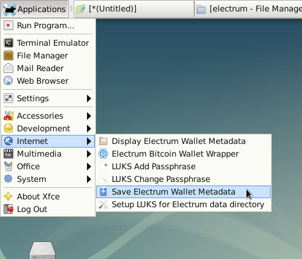

01. Open the LUKS volume by entering the passphrase.

    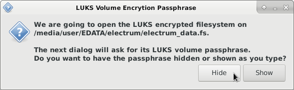

01. Select the wallet file of which you want to save the metadata. This image shows only one wallet but there could be many.

    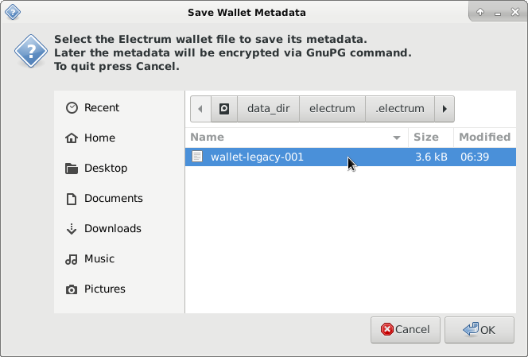

01. Fill metadata for the wallet just selected.

    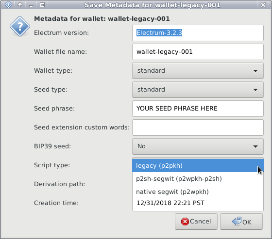

01. Choose another wallet if you want to save the metadata and press OK, otherwise press Cancel to exit.

    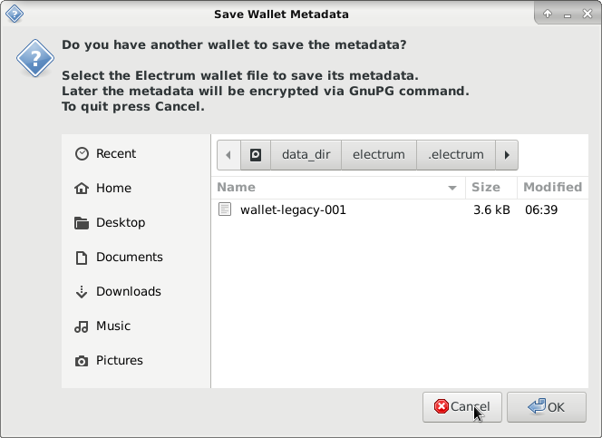


### display-wallet-metadata

Display wallet metadata saved in the metadata directory
The process is similar to *save-wallet-metadata* but it only looks at metadata files but not wallet files.


### luks-add-passphrase

Add a new LUKS passphrase along with the existing ones
The process is similar to *luks-setup-wallet-dir* but shorter.


### luks-change-passphrase

Change one of the existing LUKS passphrases with a new one
The process is almost the same as *luks-change-passphrase*.


## Passphrase suggestion

The author like passphrases based on [Diceware](http://world.std.com/~reinhold/diceware.html) which seem reasonably good and useful.

* Diceware passphrases provide good estimate for their entropy.
* They are easier to remember than passphrases consisting of random character combinations.
* Less prone to errors because passphrase words are taken from known words.

See <https://blogs.dropbox.com/tech/2012/04/zxcvbn-realistic-password-strength-estimation/>


## Cold storage and watching-only Electrum

Electrum on Bitport works in the offline mode only.
It will be useful to set up corresponding watching-only Electrum wallets on the online system.
See the following pages.

* How to create an offline wallet : <http://docs.electrum.org/en/latest/coldstorage.html>
* Creating a watch-only wallet : <https://bitcoinelectrum.com/creating-a-watch-only-wallet/>
* Bitcoin Cold storage : <https://en.bitcoin.it/wiki/Cold_storage>


## Back up wallets

It is best to create backups of your Bitport device so that you can protect your Electrum wallets from electronics failures, damage or loss of devices.
Also flash memory is known to be not too durable.
([Why I'm usually unnerved when modern SSDs die on us](https://utcc.utoronto.ca/~cks/space/blog/tech/SSDDeathDisturbing))

You can access the LUKS volume content as long as you have the LUKS container file and the LUKS passphrase.
It can be done by running the same cryptsetup command as in the wrapper scripts, but it could be tedious if you try to do it on a secure offline computer.

However it would be easier to do so if you have multiple copies of your Bitport device.
Then back up is trivial.
You can create another Bitport USB flash drive and copy the original container file `/electrum/electrum_data.fs` to another device, placing it in the same directory `/electrum/` within the filesystem `EDATA`.

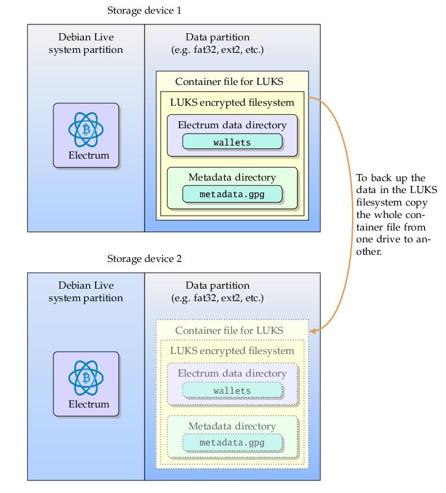

In addition to securing Bitport devices in multiple safe places it would be a good idea to backup wallet metadata on paper.

I usually keep LUKS passphrase and GPG passphrases in password managers such as Keepass and have them on multiple offline mobile devices stored in multiple places, but there may be other ways for keeping passphrases safe.

------------------------------------------------------------------------------
